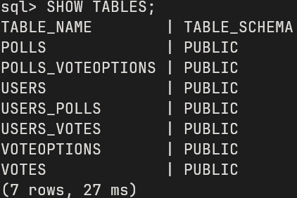
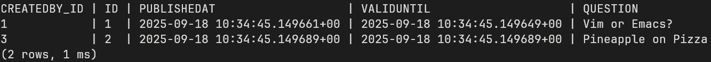
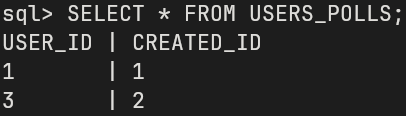
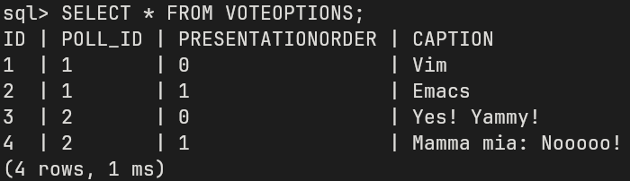

# Assignment 4

## Implementation 

Compared to the state of the implementation in assignment 3 there were not a lot
of changes made. Apart from adding `@Entity`, `@Table(name = "...")`,
`@ManyToOne` etc annotations to the [model classes](./backend/src/main/java/no/hvl/poll_manager/model/) the biggest part of the
implementation was troubleshooting issues with the reference between Polls and
VoteOptions. 

Up until this point there was no reference to a Poll from a VoteOption. When
adding this to match the expected implementation in the test cases two errors
occurred. The first one was a StackOverflowError in the Polls `hashCode` function.
The reason for this is that the auto-generated `hashCode` function by lombok via
the `@Data` annotation includes all fields of the class. But since the
voteOptions in `Set<VoteOption> options` have a reference to the poll and said
poll again has a reference to a list of VoteOptions this leads to a cyclical
definition and StackOverflowError. This was fixed by modifying the `hashCode`
function to only include the `id` of the Poll.

```
java.lang.StackOverflowError
	at java.base/java.util.HashSet.iterator(HashSet.java:182)
	at java.base/java.util.AbstractSet.hashCode(AbstractSet.java:120)
	at no.hvl.poll_manager.model.Poll.hashCode(Poll.java:29)
```

The second issue was that when creating a Poll there would be a reference to a
VoteOption that has not yet been created, since both elements rely on each other
and therefore get created at the same time. To fix this the CascadeType in the
Polls `@ManyToOne` annotation was set to `PERSIST`.

```java
class Poll {
    ...
	@OneToMany(cascade = CascadeType.PERSIST)
	@JsonIdentityReference
	Set<VoteOption> options;
    ...
}
```

```
jakarta.persistence.RollbackException: Error while committing the transaction [org.hibernate.TransientPropertyValueException: Persistent instance of 'no.hvl.poll_manager.model.Poll' references an unsaved transient instance of 'no.hvl.poll_manager.model.VoteOption' (persist the transient instance before flushing) [no.hvl.poll_manager.model.Poll.options -> no.hvl.poll_manager.model.VoteOption]]
	at app//org.hibernate.internal.ExceptionConverterImpl.convertCommitException(ExceptionConverterImpl.java:70)
	at app//org.hibernate.engine.transaction.internal.TransactionImpl.commit(TransactionImpl.java:93)
	at app//org.hibernate.internal.TransactionManagement.commit(TransactionManagement.java:63)
	at app//org.hibernate.internal.TransactionManagement.manageTransaction(TransactionManagement.java:21)
	at app//org.hibernate.SessionFactory.lambda$inTransaction$0(SessionFactory.java:282)
	at app//org.hibernate.SessionFactory.inSession(SessionFactory.java:246)
	at app//org.hibernate.SessionFactory.inTransaction(SessionFactory.java:282)
	at app//org.hibernate.internal.SessionFactoryImpl.runInTransaction(SessionFactoryImpl.java:948)
	at app//no.hvl.poll_manager.PollsTest.setUp(PollsTest.java:58)
	at java.base@21.0.8/java.lang.reflect.Method.invoke(Method.java:580)
	at java.base@21.0.8/java.util.ArrayList.forEach(ArrayList.java:1596)
	at java.base@21.0.8/java.util.ArrayList.forEach(ArrayList.java:1596)
```

### Poll Manager

Additionally to the changes to the model classes the
[PollManager.java](./backend/src/main/java/no/hvl/poll_manager/repository/PollManager.java)
was also updated to use a h2 database instead of storing the objects in lists.
The data is stored in a [file](./backend/db.mv.db) ensuring persistent data over
restarts of the application.

The implementation of the database queries was largely inspired by the
implementation in the
[PollsTest.java](./backend/src/test/java/no/hvl/poll_manager/PollsTest.java)
with the only difference being the use of 
```java
		EntityManager em = emf.createEntityManager();

		em.getTransaction().begin();
        ...
        db queries
        ...

		em.getTransaction().commit();
		em.close();
```
instead of `emf.runInTransaction(em -> {...})` to more easily return the result
of the queries.

### DB inspection

To inspect the database the
[h2.jar](https://h2database.com/html/cheatSheet.html) provided in the H2
documentation was used. With the following command the current state of the
Database can be inspected via SQL commands: `java -cp ./h2*.jar org.h2.tools.Shell -url jdbc:h2:file:./db -user sa`

Some examples:






## Future issues

The cyclical definition of the data models seems to lead to some instabilities
in the application. So a future issue to fix would be stress-testing these model
classes and fixing issues arising with the cyclical definition.

Additionally hooking up the backend to a database changed the default behaviour
to some extend and therefor led to the [PollScenarioTest](./backend/src/test/java/no/hvl/poll_manager/integration/PollScenarioTest.java)
not working anymore. So another future issue would be using a temporary test db
for this test akin to the
[PollsTest](./backend/src/test/java/no/hvl/poll_manager/PollsTest.java).
