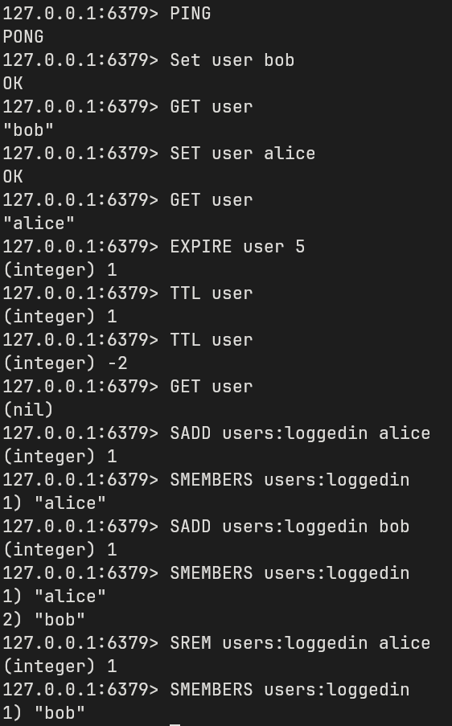
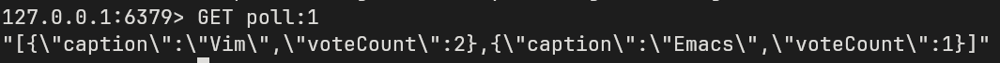

# Assignment 4

## Issues during installation

- None..
- Using redis via docker: `docker run -d --name redis -p 6379:6379 redis`
    - To inspect the redis/run commands with redis cli: `docker exec -it redis redis-cli`
    - Example redis commands:

## Implementation 

The implementation of the vote counter containt only two minor changes to the
code.

1. Adding [VoteOptionCount](./backend/src/main/java/no/hvl/poll_manager/model/CreatingVoteOptionCount.java) as the object that keeps track of the number of votes per VoteOption, indicated by the caption.
2. Extending the [PollManager](./backend/src/main/java/no/hvl/poll_manager/repository/PollManager.java):
    - Either load the number of votes per vote option from database if no cache entry exists or loading from the cache. For this the VoteOptionCount get transformed into a JSON-String and saved under the key `poll:<id>`.
    `jedis.setex("poll:" + id, 200, cacheString);` With this command both the
    keys value and expiration is set.
    - When a new Vote is entered for a specific poll the key `poll:<id>` is
       deleted. `jedis.del("poll:" + vo.getPoll().getId());`

Example of a VoteOptionCount object in redis:

## Future issues

With the implementation of the redis cache no new issues arose.
