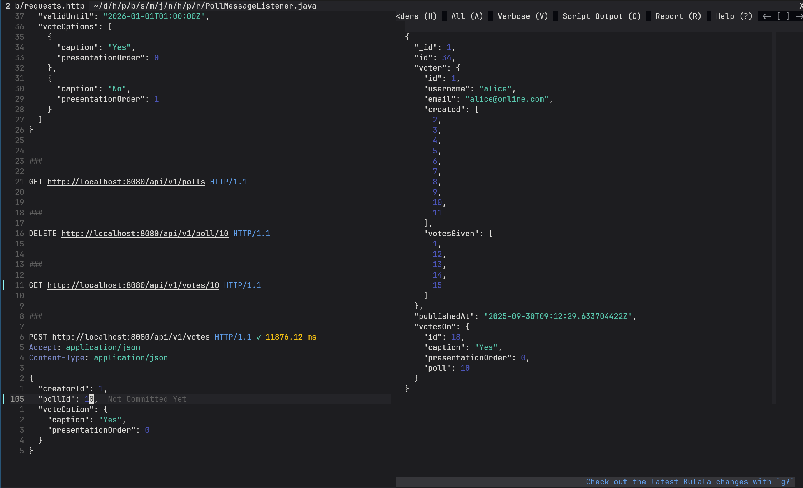
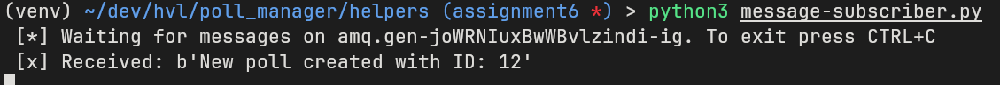
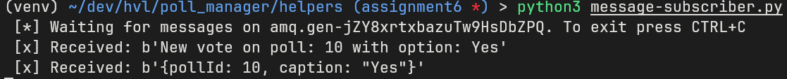
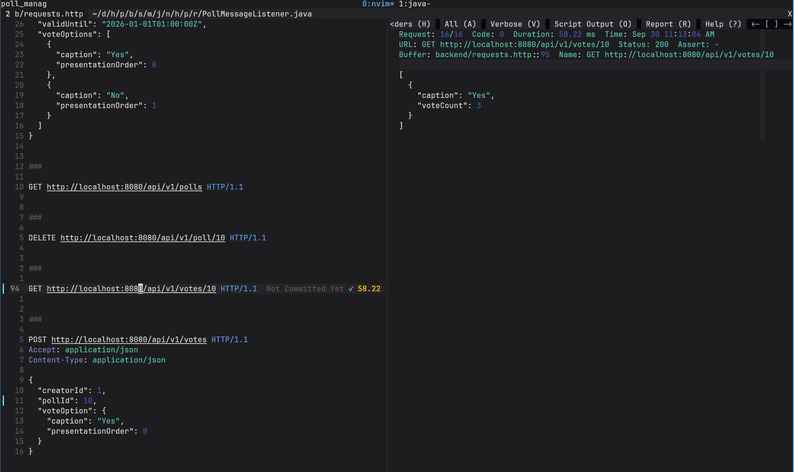

# Assignment 6

## Implementation 

The implementation of the RabbitMQ subscriber and publisher was done via the
SpringBoot API.

This included a [RabbitMQ configuration](./backend/src/main/java/no/hvl/poll_manager/repository/PollManagerRabbit.java)
and a generic [RabbitMQ listener](./backend/src/main/java/no/hvl/poll_manager/repository/PollMessageListener.java).
To send the messages a fanout exchange was chosen, so that in the case of
multiple subscribers all of them will get every message. However in the first
implementation with a topic exchange a Vote-Message could consist of only the
vote options caption, since the poll could be determined by the routing key.
With the fanout option there is no routing key anymore though, so the message
was extended to contain the `pollId` and the `caption`.

To handle these anonymous votes a new constructor in
[Vote.java](./backend/src/main/java/no/hvl/poll_manager/model/Vote.java) was
added which simply sets the voter to `null`.

The [PollManager](./backend/src/main/java/no/hvl/poll_manager/repository/PollManager.java) 
also sends two messages:
1. In case a new Poll was created: `New poll created with ID: <ID>`
2. In case a new Vote on a Poll was created: `New vote on poll: <ID> with option: <Caption>`
For these two special cases additional logic was added to the [RabbitMQ listener](./backend/src/main/java/no/hvl/poll_manager/repository/PollMessageListener.java)
to ignore the messages.

Here are some screenshots of the messages being send and the changes to the
database. To test the messaging there are small pyhton application for both
[sending](./helpers/message-sender.py) and [subscribing](./helpers/message-subscriber.py).

## Future issues

- The fanout solution without queue names seems not optimal, since a client will
  get every message for every poll and not just a specific poll by pollId. This
  seems to be the only possible option with RabbitMQ though so maybe trying
  different options like Kafka or MQTT might be a future issue.
